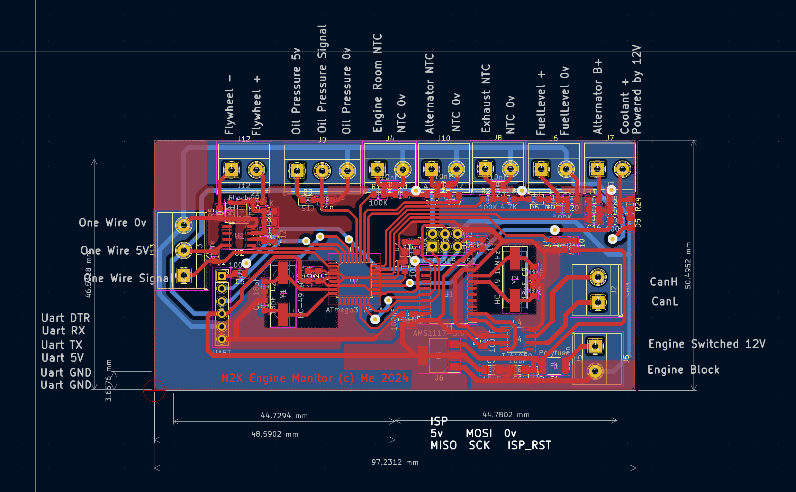
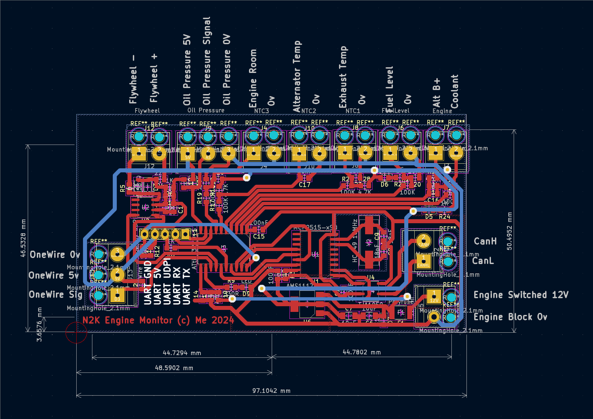

# N2K Engine Monitor

This monitors an engine, mostly temperatures and fuel, emitting suitable N2K messages. Targeting a Volvo Penta D2-40. Code and pcb are based on the interface board in https://github.com/ieb/EngineManagement, however this time the pcb is from scratch using a Atmel 328p directly to make the unit more robust. The original has been in service for 3 years with no problems seen, outlasting the Volvo Penta MDI unit, which failed 2x in < 4 years. Ok, the replacement was based on relays following the Perkins schematic for the same engine, so not really hard to do.

# PCB

Single board. If using a 328p chip you will need to flash the bootloader. See programBootLoader for details. 

## 328p based board 

## Attiny3226 Board, 12bit ADCs and better RPM accuracy

# Setup

Setup starting with a new board, this is for 3226 which the preferred board.

* Test the board supply to check power consumption, should be about 30mA at both 5v and 12v.
* Connect up a UDPI programmer, and serial monitor.
* Burn Fuses, and tune the internal clock on the 3226, see tuning3226/README.md
* Upload the code.
* Connect a CAN bus with 1 other device.
* Verify CAN messages are sent and received (menu item d)
* Measure and set the supply voltage to the chip after powering with 12v. (menu item V)
* Check the Sensor diagnostics (menu item D, and M), might need to connect some NTC sensors and fake up flywheel source.
* Set the engine hours to match the existing board.
* Install the board

## Changes from original build 4 years ago

* All components SMD, no draughtboards or modules with pin headers to fail.
* Switched from a LM385 to a LMV393 for the flywheel pulse generator as all I need is a clean square wave to count the pulses. (actually I miss ordered 10 LMV393's and then switched over).
* Changed to a 16MHz crystal on the MCP2515 since this is what the 328p is using. Perhaps 1 crystal would work for both, but probably not.

# Memory usage

after reducing memory requirements (580 used before), varies up an down a bit with debug.

attiny3226

    RAM:   [==        ]  20.1% (used 619 bytes from 3072 bytes)
    Flash: [========  ]  81.1% (used 26579 bytes from 32768 bytes)
NB, no malloc in use in code.
Over 77% Flash usag pio inspect no longer works, however removing One wire code may give enough space for debug symbols to allow inspect to work

# Status bits.

The status bits in PGN 127489 are set to indicate an alarm condition.

WHen an alarm condition is set if the check engine, maintenance or emergency stop bits are set, they are not
cleared when the alarm clears. Generally advisable to stop the engine and check.

Emergency stop will be set when temperatures are too high. Best to stop the engine before damage occurs.

Over Temperature status 1 bit 1 set when over temperature is suspected including coolant (> 90C), exhaust > 80C, alternator > 100C, engine room > 70C. Will also set check engine and engine emergency shutdown alarms.

Low oil pressure alarm is set when oil pressure is < 10psi.

If sensors fail then engine comms alarm is set.

Water flow alarm is set when th exhaust temperature > 80C as there is probably no raw water.

Charge indicator alarm is set when the alternator voltage is < 12.8V

Engine shutdown alarm will be set when the engine is shutting down.

Other alarms are not set at this time.

# Building and Uploading

## Attiny3226 based board

Use UDPI. I use the old, slow and slightly buggy jtag2udpi programmer loaded onto an Uno. I use https://github.com/ieb/jtag2updi forked just in case. After programming the Uno needs a 10uF cap between reset and ground to prevent a reset on the Uno when programming starts.  The UDPI output is on Digital Pin 6 and connects via a 4K7 Resistor to the UDPI pin on the Attiny3226. The target board should be powered separately, and the serial monitor can remain attached while programming. Do not power the board using both a serial converter and the 12v power supply as this will cause the serial port to draw too much USB current and be shutdown. Programing setup is in platformio.ini. Before programming a fresh chip, set the fuses to set the CPU Frequency.

Fresh boards also need to go through a runing process , see tuning3226/

Obviously edit platform.ini with the correct serial ports for upload and monitoring.

    pio run -e attiny3226 -t fuses

Then upload code with an upload command. Fuses only need to be set once per chip.

    pio run -e attiny3226 -t upload

To monitor 

    pio device monitor

### Clock Tuning 3226

The 3226 board uses an internal oscilator due to lack of pins and so it needs tuning from a board with a quartz crystal as per https://github.com/SpenceKonde/megaTinyCore/blob/master/megaavr/extras/Ref_Tuning.md. The Tuning source needs to be https://github.com/SpenceKonde/megaTinyCore/tree/master/megaavr/libraries/megaTinyCore/examples/TuningSource uploaded onto a Uno or any 328p with pin 9 available. The UNO must have an real crystal not a resonator.  The tuning code is https://github.com/SpenceKonde/megaTinyCore/tree/master/megaavr/libraries/megaTinyCore/examples/megaTinyTuner, but for these boards must be modified to use PB1 as the timing pin since this is exposed directly. (Oil pressure sense).  Copies of both of these are in tuning as they needed minor modifications.

## 328p based board

Can be built on any 328p suitably wired, however to build using the pcb design first flash a bootloader, see [programBootLoader/README.md] for details, then come back here.

Having flashed with the urbootloader connect a serial adapter configured for 5V to the serial header pins, adjust platform.ini to reflect the serial port and run

    pio run -t upload

to monitor

    pio device monitor

Do not attempt to power the board both on the 12v line and through the serial port 5v at the same time. This will probably shutdown the USB port on your laptop (or worse produce some smoke) Monitoring over serial can be done provided only GND, TX and RX are attached. Ie no power from the serial adapter.

# LM393 RPM to pulses

Critical that this chip as a 100nF decoupling capacitor. Without it it will generate pulses from power supply noise with the inputs shorted together. See schematic. LTSpice models don't predict this behavior.

# Engine Events

Stores upto 29 events in EEPROM, with a 15s resolution and one of upto 255 types.
All the following PGNS have standard priorietary PGN format + a Function code byte.
The Manufactore code is 2046 and the Industry is Marine, ie 4.

## PGN 65305L

Stadard  Packet proprietary, 8 bytes

| Field | Length | Value     | Description            |
|-----------------------------------------------------|
| 1     | 11 bits| 2046      | Manufacturer code      |
| 2     | 2 bits |           | Rserved                |
| 3     | 3 bits | 4 (0b100) | Industry Code          |
| 4     | 8 bits |           | Requst Function Number |
| 5     | 5 bytes|           | reserved/payload       |

|  Function | Description         | Valid PGN | Response                              |
|-----------|---------------------|-----------|---------------------------------------|
| 11        | Get events          | 65305L    | Events PGN 130817L Functon 12         |
| 12        | Get events response | 130817L   | List of events                        |
| 13        | Clear events        | 65305L    | ACK PGN 65305L Functon 14, no payload |
| 14        | Clear events ACK    | 65305L    | Ack clear events, no payload          |

## PGN 130817L

| Field | Length | Value     | Description            |
|-------|--------|-----------|------------------------|
| 1     | 11 bits| 2046      | Manufacturer code      |
| 2     | 2 bits |           | Rserved                |
| 3     | 3 bits | 4 (0b100) | Industry Code          |
| 4     | 8 bits |           | Requst Function Number |

## Function 12

| Field   | Length  | Value               | Description                            | 
|---------|---------|---------------------|----------------------------------------|
| 4       | 1 byte  | uint8_t             | Number of events                       |
| 5+(n*4) | 1 byte  | uint8_t             | Event ID                               |
| 6+(n*4) | 3 bytes | 3Byte UDouble 0.001 | Engine Hours of event (15s resolution) |

| Event ID | Meaning |
|----------|---------|
| 0        | Current engine hours, no event |
| 1        | Engine Stop |
| 2        | Low Oil Pressure |
| 3        | High Coolant Temperature |
| 4        | High Exhaust Temperature |
| 5        | High Alternator Temperature |
| 6        | High Engine Room Temperature |

# Todo

* [x] build board.
* [x] Flash bootloader and test
* [x] Port code from original
* [x] Allow for 16MHz MCP2515 oscillator, current library uses 8MHz.
* [x] Handle when engine not running, now that device is powered from CanBus
* [x] Reduce memory requirements in EngineSensorts and bind measurements to messages.
* [x] PR SmallNMEA2000 with changes
* [x] Test and Calibrate NTCs
* [x] Test and Calibrate Coolant and fuel
* [x] Test On N2K Bus
* [x] Implement 1 wire
* [x] Allow Engine Hours to be set via serial
* [x] Improve status and diagnostics to include n2k traffic
* [x] Implement status alarms
* [x] Consider swapping NTC4 for a oil pressure sensor if it can be accommodated.
* [x] Power from Engine supply since oil pressure sensors use > 10mA typically. This means fuel levels and temperature will only be available with engine controls turned on.
* [x] Check voltage calibration, some doubt over digtal multi meter accuracy used previously - verified against a ADS1115 to be accurate
* [x] Add firmware version, shows on the help, press h when connected over serial.
* [x] Create a attiny3226 based board, with 12bit ADCs for better resolution on the voltages.
* [x] Calibrate CPU clock
* [x] Verify RPM accuracy (measured at +- 0.2% relative to calibrated 16Mhz crystal)
* [x] Verify NTC and other ADC readings.
* [x] Install onboard
* [x] Implement event storage
* [x] Implement PGN proprietary messages to query engine events.
* [x] Update schematic to improve ADC stability when charging main LiFePO4s
* [x] Fix OneWire on Attiny3226 (see lib/vportonewire)
* [x] Fix event streaming to contain the right number of events including current hours.
* [x] Read stop button, on PC0. This will go to 12V when the solenois is powered.
* [x] Lowered alternator low voltage alarm to 12.2v and added window for overheat to combat high noise levels on the coolant sensor.
* [x] Added window period for all alarms to avoid 1 reading triggering alarm condition, set a 5s. 

# Could do... but probably will not

The board currently runs of switched engine power, so to read fuel tank and batteries the engine has to be turned on. This is good, since power consumption becomes irrelevant although its typically < 80mA. I could optimize so that the board could be powered from the Can bus, but probably wont. Better to have it off when 
not relevant.. eg when sailing.

# New Board check list

* Oil sensor with pot
* NTCs, set Vdd then 10K == 25C, 22K == 8C, Check thermstor against room temp and body temp.
* Check Fuel 190R == full 0R == empty, linear, 120R == 120/190 = 63%  47/190 == 24
* Check AltV by connecting to suppy V
* Check Coolant, Supply -> 1K top. 22R == 120C, 120R == 60+10*(134-120)/(134-97) = 63
* Check RPM with a 1KHz signal
* Check oneWire
* Check CAN and engine events are responding, verifies can read and write.

